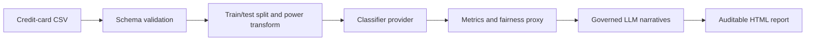

# FraudLens


FraudLens is an auditable batch fraud-detection workflow for the
[Kaggle credit-card fraud dataset](https://www.kaggle.com/datasets/mlg-ulb/creditcardfraud).
It scores transactions with interchangeable classifiers and produces a self-contained HTML
report with performance metrics, risk-ranked explanations, a fairness proxy, and run metadata.

It is decision support for a human fraud analyst—not an automated transaction-blocking system.

## What it does



- Supports logistic regression, random forest, and the default SMOTE-backed XGBoost classifier.
- Keeps preprocessing and oversampling inside the training path to avoid test-set leakage.
- Ranks the highest predicted fraud probabilities for optional LLM-assisted statistical narratives.
- Includes confusion-matrix and ROC charts, `Amount`-quartile flag-rate and precision views, plus
  model configuration and row counts in every report.
- Validates the exact dataset schema before inference and rejects unsafe archive paths during data
  download.

## Quick start

FraudLens targets Python 3.12.

```bash
python3.12 -m venv .venv
source .venv/bin/activate
python -m pip install -r requirements.txt
```

### Download the dataset

Create a Kaggle API token and save it at `~/.kaggle/kaggle.json`, then run:

```bash
python scripts/fetch_data.py
```

The command downloads the source data into `src/data/`, which is intentionally ignored by Git.

### Generate a report

```bash
python -m src.app \
  --provider xgboost \
  --llm-provider ollama \
  --output reports/fraud_report.html
```

Available classifier providers:

| Provider | Training approach |
| --- | --- |
| `logreg` | Logistic regression on the original training fold |
| `rf` | Random forest on the original training fold |
| `xgboost` | XGBoost on a SMOTE-resampled training fold (default) |

The application accepts only the Kaggle schema: `Time`, `Amount`, `Class`, and `V1` through
`V28`. This protects the model and LLM explanation path from arbitrary CSV fields.

## LLM explanations

By default, FraudLens uses a local Ollama provider. To use Claude or OpenAI, copy the environment
template and add the relevant API key:

```bash
cp .env.example .env
```

```bash
python -m src.app --llm-provider claude
python -m src.app --llm-provider openai
```

Narratives are generated at temperature zero and describe statistical deviation in anonymized PCA
features only. They do not claim a causal or business reason for fraud. If an LLM call fails, the
report records a safe fallback explanation instead.

## Docker

```bash
docker compose up --build
```

The compose configuration works without a local `.env`; use one only when selecting a hosted LLM
provider. The default Ollama provider expects an Ollama service reachable from the host.

## Quality checks

```bash
python -m pytest tests/ -v
python -m ruff check .
python -m mypy src
meerax doctor
```

CI runs the unit suite with coverage, the integration suite, project health checks, and Ruff on
every pull request.

## Governance and limitations

The dataset contains anonymized PCA features and no protected-attribute data. The report therefore
uses an `Amount`-quartile breakdown as a limited fairness proxy, not as a fairness clearance.
See [GOVERNANCE.md](./GOVERNANCE.md) for intended use, explainability boundaries, model-risk
context, LLM controls, and audit-trail details.

## License

Distributed under the [MIT License](./LICENSE).
